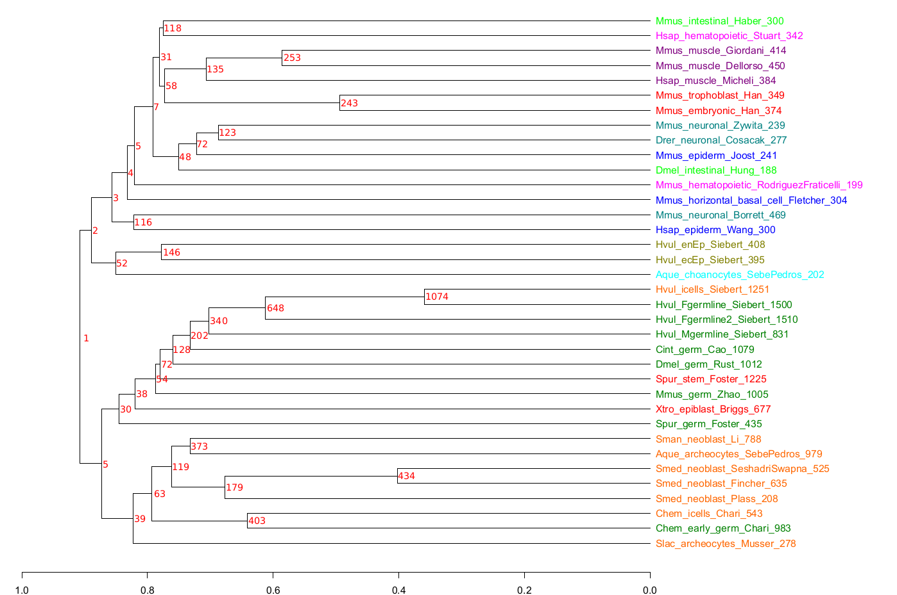

# Stem Cell Evolution: Description

This archive contains a description of the steps and results obtained of our analysis of the evolution of stem cells. 

All the informations is gathered inside this `README.md` file, the repository will be updated later to contain all the data and script to run the analysis.

The analysis is separated in 3 main steps:

- Selection of the dataset and single-cell analysis.
- Orthogroups inference using [Orthofinder](https://github.com/davidemms/OrthoFinder).
- Orthogroups analysis, clustering of the dataset.

# Dataset gathering and single-cell analysis

In order to study the evolution of stem cells, we selected some high quality single-cell RNAseq studies which contained some well defined stem cells. This following graph sum up the diversity of the stem cells and species we were able to analyze:

Each single-cell RNAseq datasets were then re-analyzed from the raw count matrix using the [Seurat](https://github.com/satijalab/seurat) package from R. The analysis consisted in the identification of the cluster of interest (the stem cell cluster) using the gene markers as described in the original paper of each dataset, and the obtention of transcript preferentially expressed in the chosen cluster.

The single-cell RNAseq analysis can be described by the folowing steps:

- Cells filtering based on filter described in the original paper.
- Normalization and scaling.
- Selection of number of PCA and number of clusters.
- Identification of cluster of interest using gene markers.
- Selection of preferentially expressed transcript using wilcoxon test.

At the end of this first step, we obtain a list of transcript that are preferentially expressed for each of the stem cells in our dataset.

# Orthology inference and clustering of the stem cells

Each obtained transcripts are then filtered based on statistic significance and translated in order to obtain their protein sequences. Orthofinder is used on this list of protein sequences to obtain orthogroups. Based on the infered orthogroups, a binary matrix of absence/presence of orthogroups for each dataset is obtained. Clustering is performed using the Jaccard distance for binary data, the clustering is represented as a dendrogram for which the number of common orthogroups per branch is shown in red. The following figure shows the final clustering obtained after filtering stem cells containing a too low amount of orthogroups:

Further enrichment analysis were performed using [clusterProfiler](https://guangchuangyu.github.io/software/clusterProfiler/) and the [MSigDB](https://www.gsea-msigdb.org/gsea/msigdb/) database based on the genes from the orthogroups, translated as murine genes.